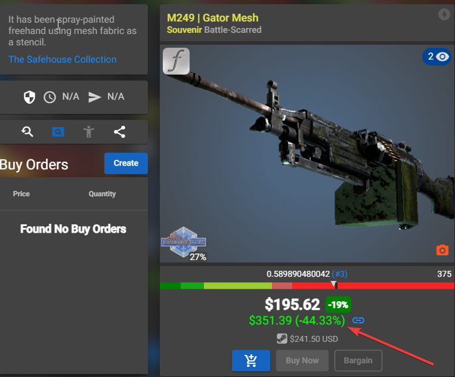
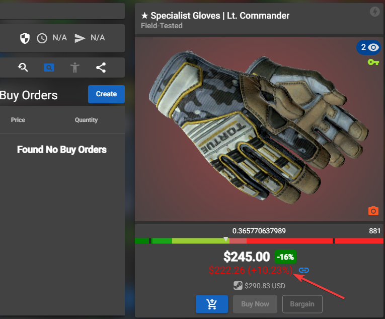

# CSFloat Buff price checker

## Description
A chrome extension to compare prices between CSFloat offers and Buff163.

This project is on GitHub to be selfhosted by those who wants to use this extension for free, no one needs to pay 200$ to have this little extension.

The api use the steaminventory-helper api to get prices of Buff.

This extension can be incomplete and not perfect but feel free to open a Pull request if you've any interesting feature to submit !

## Installation
### No api version (full version)
With this version, you'll just have to drag and drop a folder into your chrome extensions, easiest way to have the extension working
-> Go in `no-api-version` folder for more details

[Check the latest release here](https://github.com/bycop/csfloat-buff-checker/releases/latest)

### Api version
You've in each folder of `api-version` a README to help you for the installation of the api and the chrome extension.

This version will require you to make some commands and maybe modifications if you need to host the api on a server.

Feel free to create an issue if you need help on anything.

## Examples

When a price is lower than the Buff price, you'll see it in green with a `(+25%)` by example to show the profit you could make by reselling to Buff.

When a price is higher than the Buff price, you'll see it in red with a `(-25%)` by example to show the loss you will make by reselling to Buff.

## Support
You like this work and you want to help me hosting my projects ? Feel free to Buy me a Coffee

