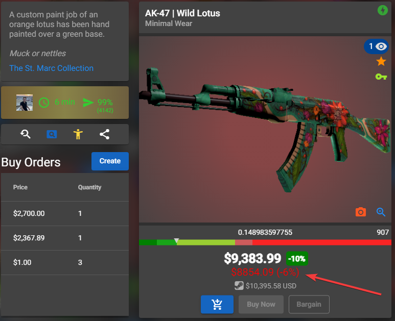

## CSFloat - Buff prices checker [Extension]

### Installation
- Download or clone this repository
- Put your chrome / chromium in dev mode on the `chrome://extensions`
- And to add the extension click on `load unpacked extension` and select the `extension` folder

If you want to change the api url, change the `http://localhost:3000` in `manifest.json` and `content.js`

### Usage
If the extension and the api are configured and are running/enabled, you can just go on any item on csfloat.com and you'll see the price comparison with Buff.

You'll see the Buff price on all items url like https://csfloat.com/item/id 

### Examples

When a price is lower than the Buff price, you'll see it in green with a `(+25%)` by example to show the profit you could make by reselling to Buff.

When a price is higher than the Buff price, you'll see it in red with a `(-25%)` by example to show the loss you will make by reselling to Buff.

