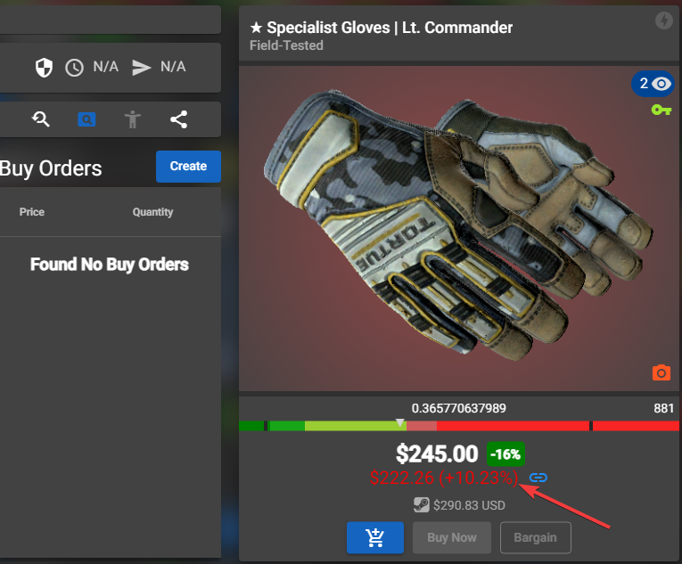

# CSFloat - Buff prices checker [No API Version]
This version doesn't require to setup the `api`

### Installation
- Download or clone this repository
- Put your chrome / chromium in dev mode on the `chrome://extensions`
- And to add the extension click on `load unpacked extension` and select the `no-api-version` folder

### Usage
If the extension is well installed you can just go on any item on csfloat.com and you'll see the price comparison with Buff.

You'll see the Buff price on all items url like https://csfloat.com/item/id 

### Examples

When a price is lower than the Buff price, you'll see it in green with a `(+25%)` by example to show the profit you could make by reselling to Buff.

When a price is higher than the Buff price, you'll see it in red with a `(-25%)` by example to show the loss you will make by reselling to Buff.

### Support
You like this work and you want to help me hosting my projects ? Feel free to Buy me a Coffee

